# 🏠 Yanolja Project 🏠
This is a **Yanolja Project** 
that implements the user's accommodation reservation system and the business operator's accommodation registration and management system.

 

## ⚙ Requirement
For building and running the applicaion you need:
* `Spring Tool Suite 4`
  * jdk1.8.0_361
  * JavaSE-17
  * STS4 3.1.3
* `HeidiSQL-12.5.0.6677`
  * MariaDB / MySQL

 

## 🎮 기능
* 음악 재생 창
	* 음악재생버튼
		* 첫 번째 클릭 시, 음악을 불러오면서 재생바의 시간이 0:00 에서 각 음악의 전체 재생시간으로 변경
		* 두 번째 클릭 시, 음악 재생 
	* 좋아요 기능
		* '하트' 클릭을 통해 좋아요를 누름
	* 담기 기능
		* '+' 클릭을 통해 플레이 리스트에 추가/삭제
	* 음악 재생 바
		* 음악이 재생되는 과정/시간을 나타내는 슬라이드
		* 원하는 음악 재생 위치로 이동 가능

## 🎮 Functions
* Music Playback Window
	* Music play button
		* The first click changes the playback bar's time from 0:00 to the total playback time of each music
		* The second click, play music!!
	* Like button
		* Click 'Heart' on the music they like
	* Add button
		* Add/Delete the music by clicking '+'
* Progress bar
	* Progress bar showing when music is played
	* Move to the desired music playback location

 

## 📁 Code Package
* musicPlay 패키지
  > * main.java 
  > * main.css  :  화면 디자인 CSS
	> * musicPlay.fxml  :  음악 재생 창 구현
	> * MusicPlayController.java  :  음악 재생 controller

 

## 🎞 DEMO

## 사용자 계정 관리
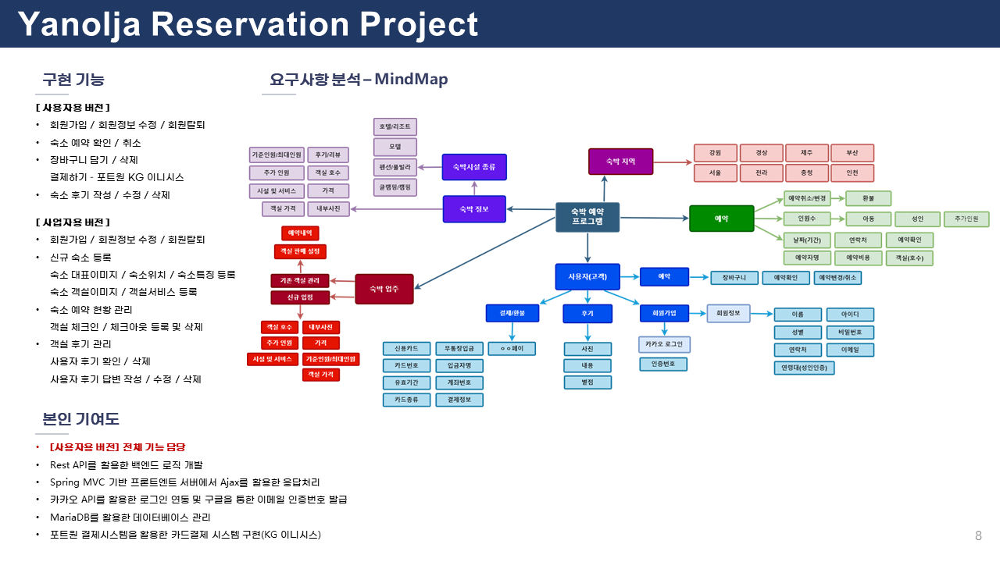
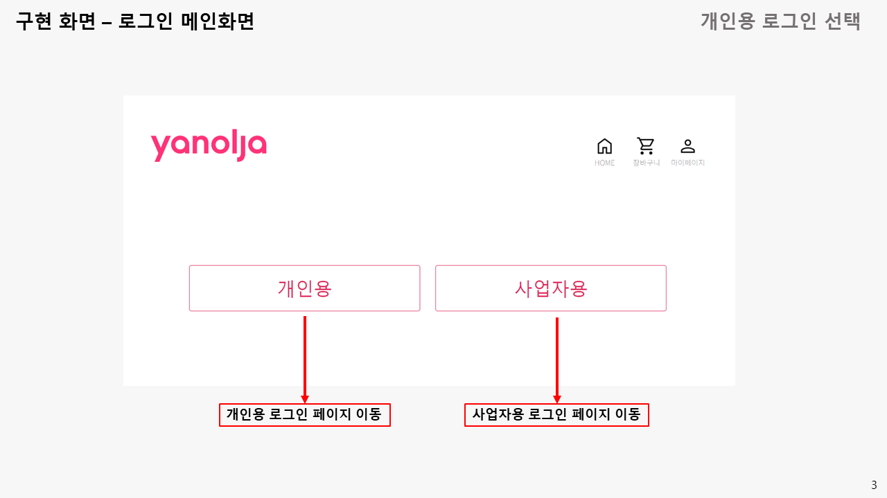
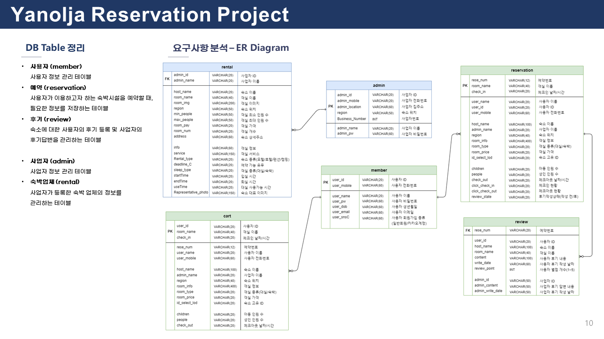
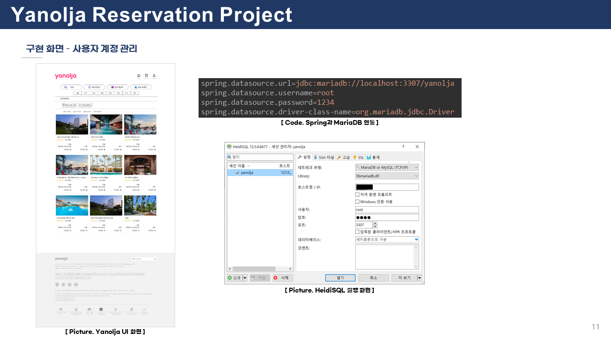
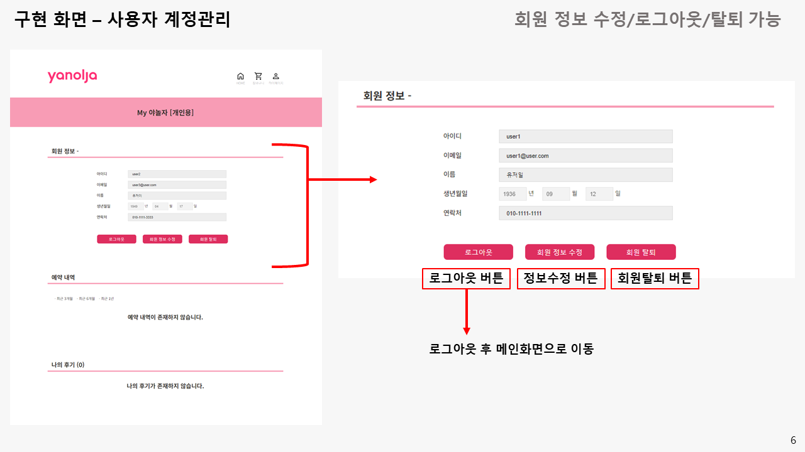
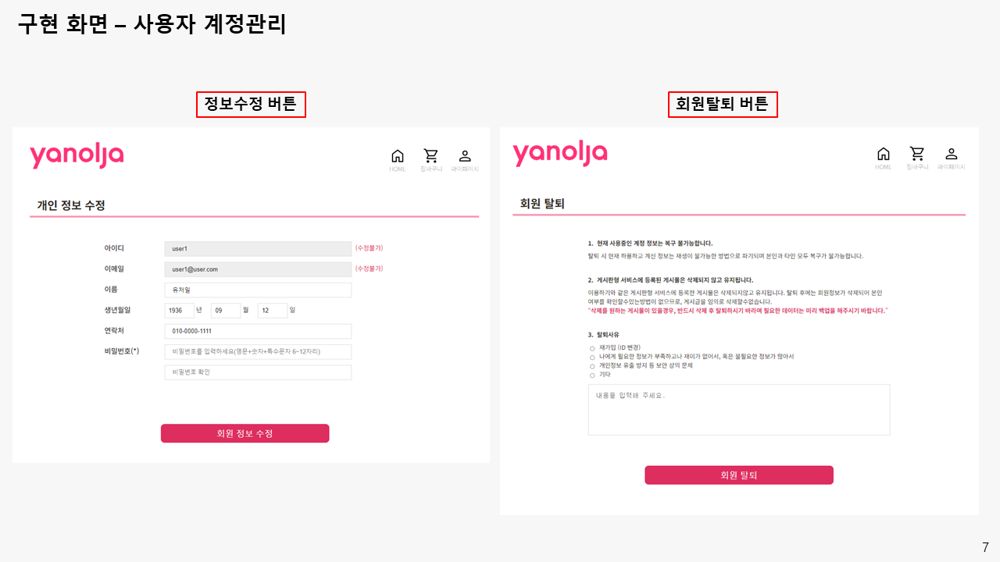

 
## 사용자 숙소 예약
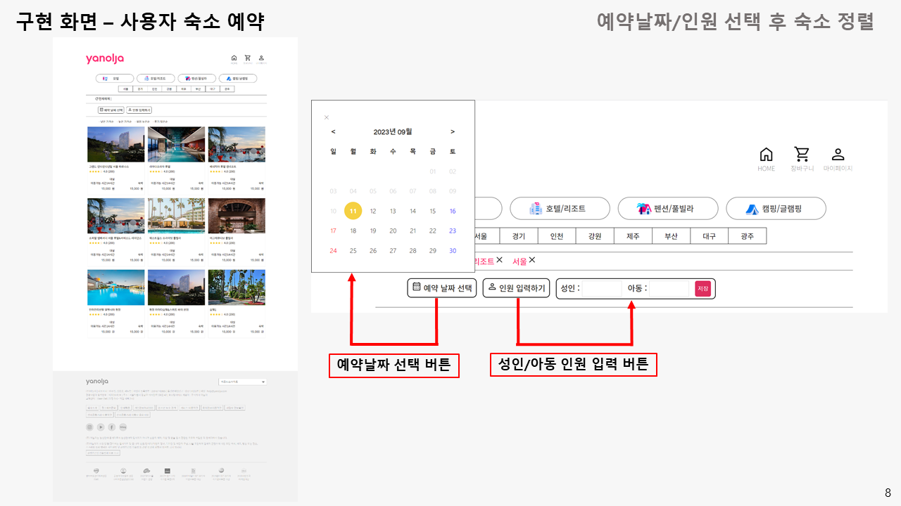
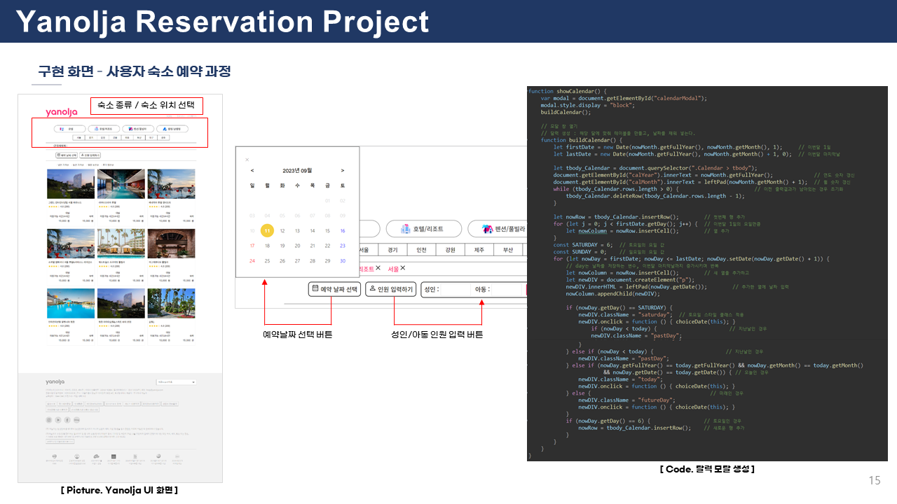
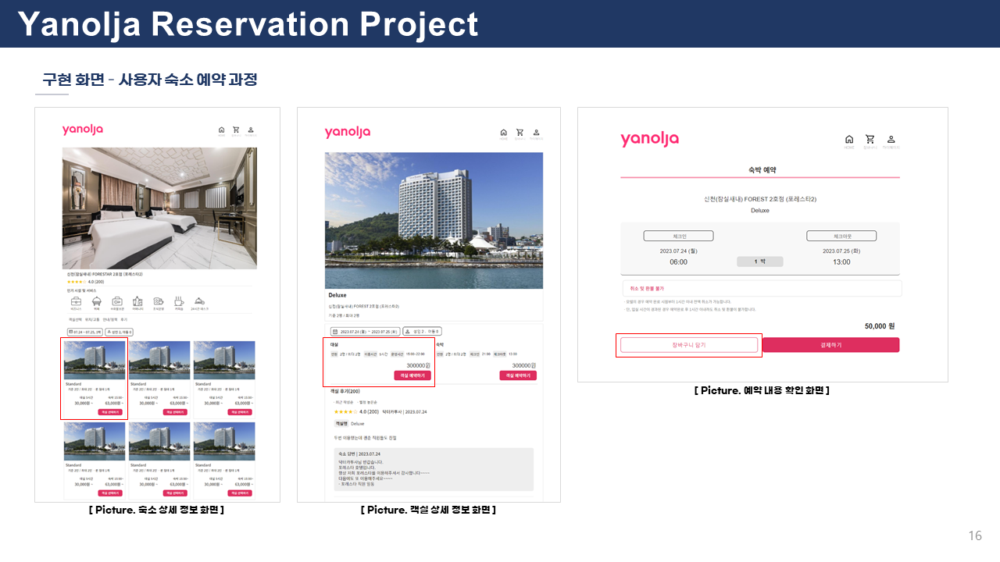
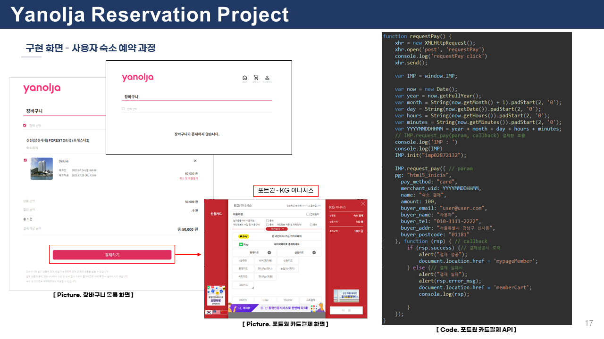
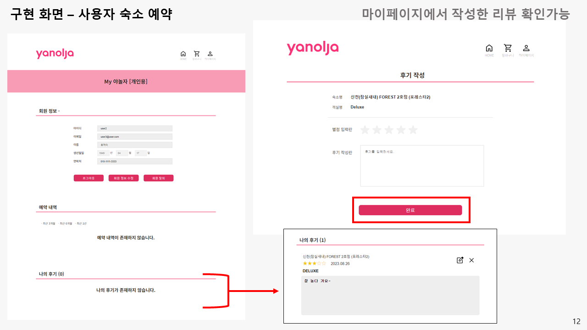
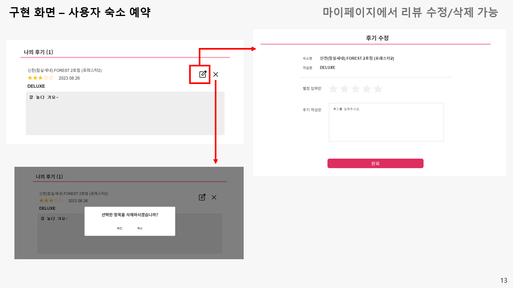

 
## 사업자 계정 관리
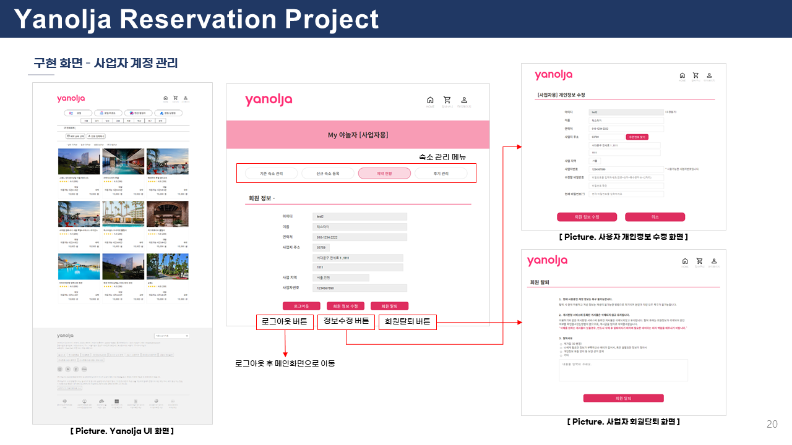
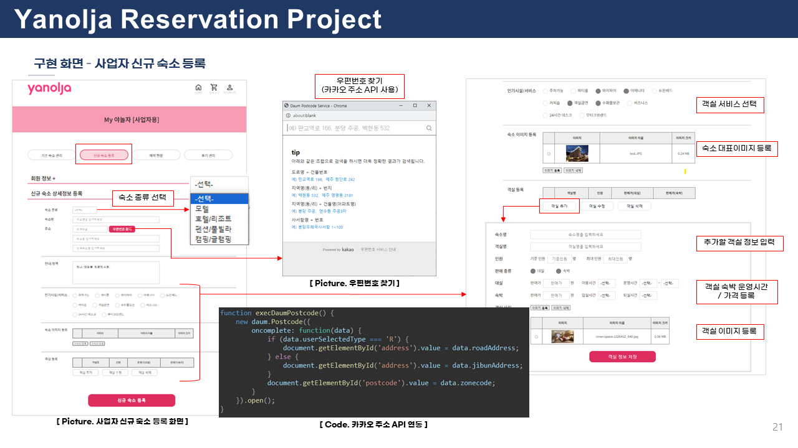
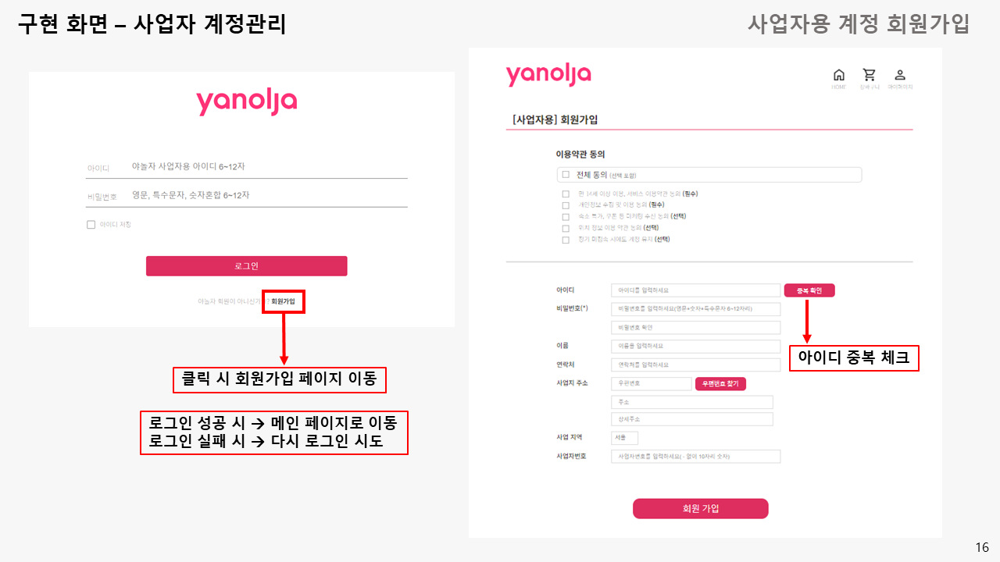
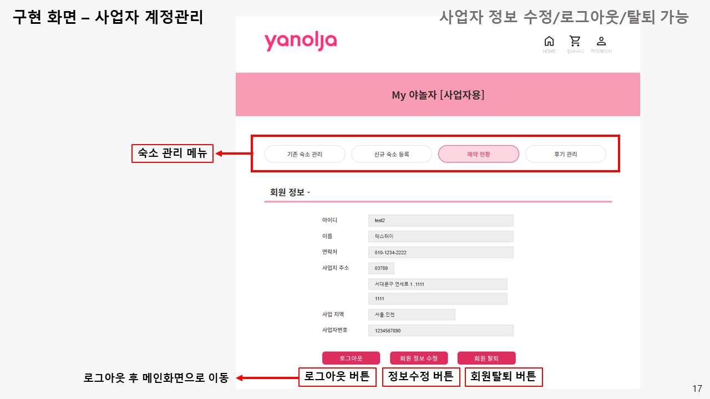
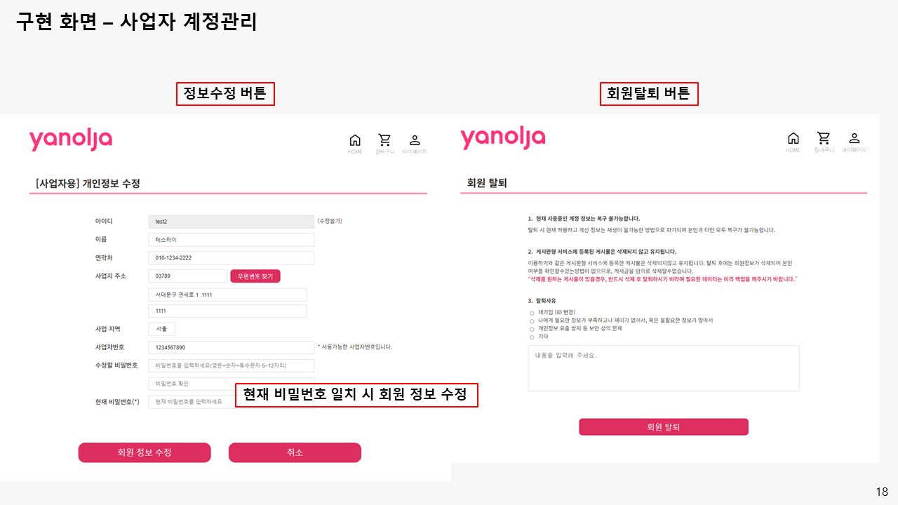

 
## 사업자 신규 숙소 등록
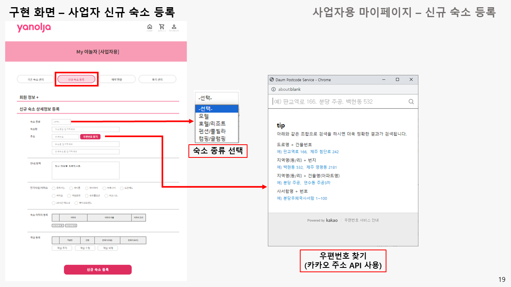
