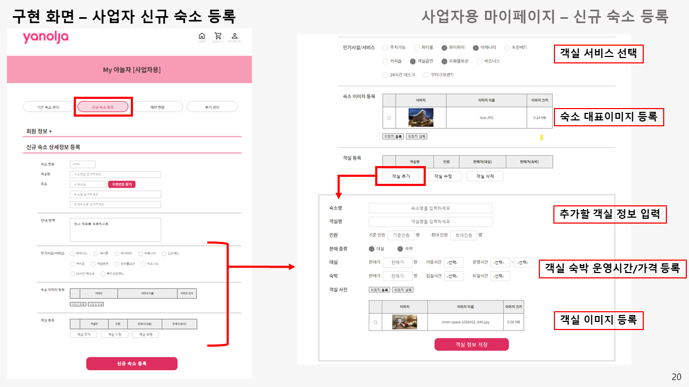
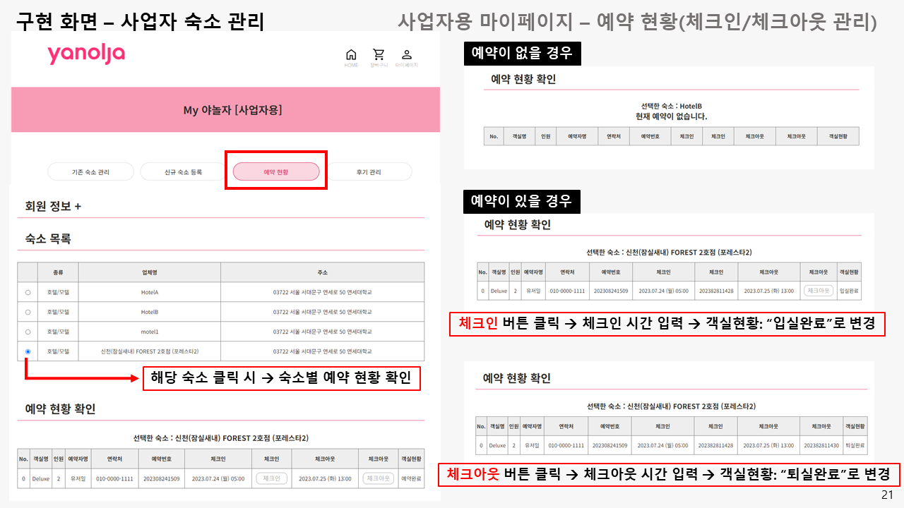
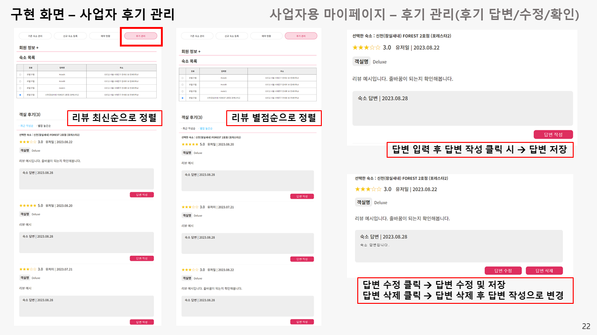

# 🏠 Yanolja Project 🏠
This is a **Yanolja Project** 
that implements the user's accommodation reservation system and the business operator's accommodation registration and management system.

 

## ⚙ Requirement
For building and running the applicaion you need:
* `Spring Tool Suite 4`
  * jdk1.8.0_361
  * JavaSE-17
  * STS4 3.1.3
* `HeidiSQL-12.5.0.6677`
  * MariaDB / MySQL

 

## 🎮 기능
* 사용자
	* 회원가입 / 회원정보 수정 / 회원탈퇴 
	* 숙소 예약
 		* 장바구니 담기 / 장바구니 삭제
  		* 결제하기 - `포트원 - KG 이니시스`
      		* 예약 확인 / 예약 취소
	* 리뷰 작성 / 리뷰 수정 / 리뷰 삭제		

* 사업자
	* 회원가입 / 회원정보 수정 / 회원탈퇴 
	* 신규 숙소 등록
 		* 숙소 대표이미지 / 숙소 위치 / 숙소 특징 등록
  		* 숙소 객실이미지 / 객실 서비스 등록
	* 숙소 관리
   		* 숙소 예약 현황 확인
       		* 객실 체크인 / 체크아웃 등록
        * 리뷰 관리
          	* 사용자 리뷰 확인 / 삭제
          	* 사용자 리뷰 답변 달기 / 수정 / 삭제

## 📁 Code Package

 

## 🎞 DEMO

## 사용자 계정 관리

 

## 사용자 숙소 예약

 

## 사업자 계정 관리

 

## 사업자 신규 숙소 등록

